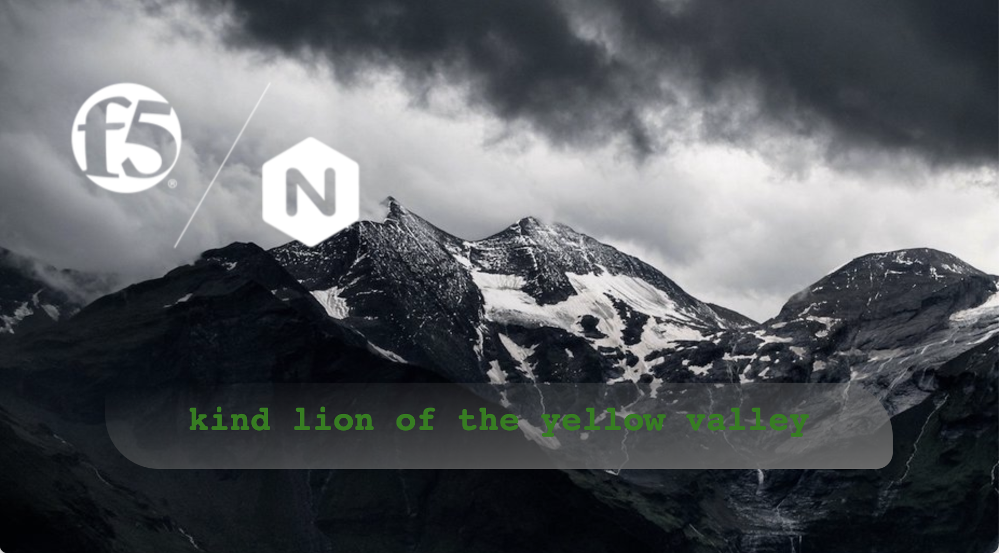

This is a very simple kubernetes demo application intended to show most of the benefits of using F5 Technology for your application delivery and security.

- It is composed of multiple technology frameworks.
- This is extension based on https://github.com/fchmainy/nginx-aks-demo
- `Go to original app location for detailed description`
- This app will generate a sentence :)



## Absolute URL version

- This version of Sentece App supports absolute paths between all componets for demonstrating Multi CLoud Networking Solutions
- Yes, you can place different components to different locations and k8s clusters
- Incecure https URLs are supported to simplyfy your labs

## Description 

Folder `k8s/absolute-path-app` contains full declarations for each part of app
- Attributes: adjectives, animals, clors and locations
- Generator
- Frontend

Environment variables at deployment declarations are used to define a URL to point to required components.

_Beaware that default `Service type is LoadBalancer`! Handy for managed k8s, problem for hosted ones_

## Deployment example

1. **Clone repo**:
```
git clone https://github.com/sokkolchen/sentence-app.git
```
2. **Deploy atributes services**<br />
Run all attributes in your Kubernetes environment
```
kubectl apply -f ./k8s/absolute-path-app/all_attributes.yaml
```
This command will deploy 4 `PODS` and 4 `SERVICES` in **LoadBalancer** mode. All `services` listen on port 80 and 443 and all `PODS` on port 8080 and 8443 accordingly.<br />

3. **Get domain names for your microservices**<br />
```
$ kubectl get services
NAME         TYPE           CLUSTER-IP       EXTERNAL-IP                                                               PORT(S)                      AGE
adjectives   LoadBalancer   172.20.140.70    a2dc92a55edf1415a94a40d2bb61ee0a-1469508715.eu-west-3.elb.amazonaws.com   80:31961/TCP,443:32084/TCP   9d
animals      LoadBalancer   172.20.180.74    abbe0755213c44bbb829194d2324d9d9-105633954.eu-west-3.elb.amazonaws.com    80:31888/TCP,443:32484/TCP   9d
colors       LoadBalancer   172.20.196.230   a35eea8bf1e5143a599f259a85c47a46-1083722869.eu-west-3.elb.amazonaws.com   80:31751/TCP,443:32675/TCP   9d
locations    LoadBalancer   172.20.9.229     adee2edd565b34371b907c190d2ed48d-2061654509.eu-west-3.elb.amazonaws.com   80:30417/TCP,443:31746/TCP   9d
```
You can check that service is running via public link
```
$ curl -k https://a35eea8bf1e5143a599f259a85c47a46-1083722869.eu-west-3.elb.amazonaws.com/colors
[
  {
    "id": 1,
    "name": "red"
  },
  {
    "id": 2,
    "name": "blue"
  },
  {
    "id": 3,
    "name": "green"
  },
  {
    "name": "black",
    "id": 4
  },
  {
    "name": "yellow",
    "id": 5
  }
```
4. **Deploy name generator**<br />
Change kubeconfig or clone git repository to new location if needed.</br>
Modify the YAML deployment file `generator-direct.yaml` with the your right `*URL` variables value at the end. This values should contain your domain from previous step. The `generator` needs this information to reach the service over Internet or your private network.
```yaml
...
        env:
        - name: ADJECTIVESURL
          value: 'https://a2dc92a55edf1415a94a40d2bb61ee0a-1469508715.eu-west-3.elb.amazonaws.com/adjectives'
        - name: ANIMALSURL
          value: 'https://abbe0755213c44bbb829194d2324d9d9-105633954.eu-west-3.elb.amazonaws.com/animals'
        - name: COLORSURL
          value: 'https://a35eea8bf1e5143a599f259a85c47a46-1083722869.eu-west-3.elb.amazonaws.com/colors'
        - name: LOCATIONSURL
          value: 'https://adee2edd565b34371b907c190d2ed48d-2061654509.eu-west-3.elb.amazonaws.com/locations'
```

Then, run the deployment
```
kubectl apply -f ./k8s/absolute-path-app/generator-direct.yaml
```

Check domain name for generator
```
$ kubectl get services
NAME         TYPE           CLUSTER-IP       EXTERNAL-IP                                                               PORT(S)                      AGE
generator    LoadBalancer   172.20.43.164    a9c8d2c6ebeb146c78854f19c26fdd6f-638416780.eu-west-3.elb.amazonaws.com    80:30244/TCP,443:30070/TCP   9d
```

Check generator is running ok over that name
```
$ curl -k https://a9c8d2c6ebeb146c78854f19c26fdd6f-638416780.eu-west-3.elb.amazonaws.com/name
{"adjectives": "calm", "animals": "whale", "colors": "yellow", "locations": "park"}
```

5. **Deploy name frontend**<br />
Use same approach we used for generator at step 4. to deploy frontent with `frontend-namespace-generator.yaml`</br>
You should see same page as on picture above as a result.

Enjoy!!